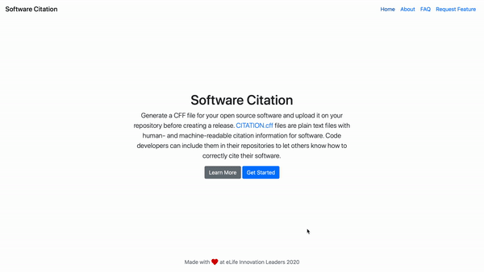

# [WIP] Software Citation Project
_"Enabling research software engineers to add citability in open source software without hassle."_

Software Citation Project is a project aimed at open source software developers who want to enable citability in their software. Open source softwares and packages are widely used and a common problem the developers face is establishing citability to their softwares. Citability is important for researchers for professional as well as personal reasons. It gives them the due credit and recognition. The most common way to enable citation is attaching a DOI through services like [Zenodo](https://zenodo.org) but you would ideally want to attach a [CFF file](https://citation-file-format.github.io) to your software as well. `CITATION.cff` files are plain text files with human- and machine-readable citation information for software. Code developers can include them in their repositories to let others know how to correctly cite their software.

The chicken and egg problem: Zenodo requires you to upload a GitHub release file for your software to which it then attaches a DOI. For this, you have already published a new release for your software without a `CITATION.cff`! Software Citation Project aims to solve this problem by providing a platform which creates a `CITATION.cff` file for your software which you can push to GitHub and then publish a release for Zenodo DOI.

This project is a part of [eLife Innovation Leaders 2020](https://elifesciences.org/labs/fdcb6588/innovation-leaders-2020-introducing-the-cohort).

# Relevant information
- [Software Citation Backend](https://github.com/sarthak-sehgal/software-citation-backend)
- [Mock designs](http://xd.adobe.com/view/cf2fd7e9-31c0-4c0f-5da3-265b996438cf-b91e/)
- [Problem definition](https://docs.google.com/presentation/d/1tngkEpRfdqv-j2kqkSWrimHTJvMt-n-QgNMuO4_8sBg/edit#slide=id.g7e006c827b_0_0)
- [Target user personas](https://docs.google.com/presentation/d/1qizTCN-nUCDpasogboV1ddeT-yEQNseIm253ZOrPH5Q/edit?usp=sharing)
- [eLife Innovation Leaders Program Notes](https://docs.google.com/document/d/10YZZgZtRoXADyR1WgYTsLw5JK6ZIVDz7gHquzeSy2fw/edit#heading=h.f5z6lwqj0xj)

# Milestones
- [x] User journey
- [x] Wireframes
- [x] Project Setup
- [x] Landing page
- [x] Step 1 UI
- [x] Zenodo API server integration
- [x] Step 2 UI (Display sample metadata form with placeholders)
- [x] Generate .cff and store on server
- [ ] Enable users to add authors in step 2
- [ ] Code of conduct, Contributing Guidelines
- [ ] Create static pages (About, FAQ, Request Feature)
- [ ] Setup on server (AWS?)
- [ ] Run cron job to remove CFF files older than 1 hour